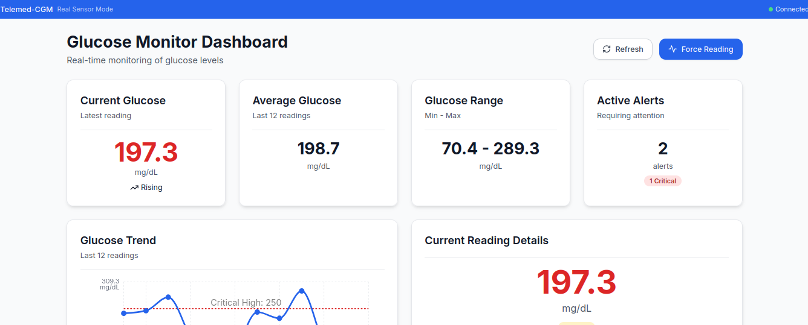

# 🏥 Telemed-CGM - Continuous Glucose Monitoring System

[](https://github.com/ninomirabile/Telemed-CGM/actions/workflows/ci.yml)
[](https://github.com/ninomirabile/Telemed-CGM/actions/workflows/deploy.yml)
[](https://github.com/ninomirabile/Telemed-CGM/actions/workflows/release.yml)
[](https://creativecommons.org/licenses/by-nc/4.0/)
[](https://www.typescriptlang.org/)
[](https://reactjs.org/)
[](https://fastapi.tiangolo.com/)

Un sistema completo di telemonitoraggio glicemico continuo (CGM) per applicazioni cliniche e di ricerca, con interfaccia web moderna e backend API robusto.

**Autore**: Antonino Mirabile




## 🚀 Caratteristiche Principali

- **📊 Monitoraggio Real-time**: Visualizzazione continua dei valori glicemici
- **🚨 Sistema di Alert**: Notifiche automatiche per valori fuori soglia
- **📱 Interfaccia Responsive**: Ottimizzata per dispositivi mobili e desktop
- **🔧 Modalità Mock**: Simulazione completa per sviluppo e testing
- **🔒 Sicurezza**: Implementazione di best practice per dati medici
- **📈 Analytics**: Grafici interattivi e trend analysis
- **🌐 API RESTful**: Backend FastAPI con documentazione automatica

## 🏗️ Architettura

```
Telemed-CGM/
├── frontend/          # React + TypeScript + Vite
├── backend/           # FastAPI + Python
├── docs/             # Documentazione tecnica
└── .github/          # GitHub Actions e templates
```

## 🛠️ Stack Tecnologico

### Frontend
- **React 18+** con TypeScript
- **Vite** per build veloce
- **TailwindCSS** per styling
- **Zustand** per state management
- **React Query** per data fetching
- **Recharts** per visualizzazioni
- **Playwright** per E2E testing

### Backend
- **FastAPI** per API REST
- **SQLAlchemy** per ORM
- **Pydantic** per validazione
- **Celery** per task asincroni
- **Redis** per caching
- **PostgreSQL** per database

## 📦 Installazione

### Prerequisiti
- Node.js 18+
- Python 3.11+
- PostgreSQL 14+
- Redis 6+

### Setup Rapido

1. **Clone del repository**
   ```bash
   git clone https://github.com/ninomirabile/Telemed-CGM.git
   cd Telemed-CGM
   ```

2. **Setup Backend**
   ```bash
   cd backend
   python -m venv venv
   source venv/bin/activate  # Linux/Mac
   # venv\Scripts\activate   # Windows
   pip install -r requirements.txt
   ```

3. **Setup Frontend**
   ```bash
   cd frontend
   npm install
   ```

4. **Configurazione Environment**
   ```bash
   cp .env.example .env
   # Modifica le variabili in .env
   ```

5. **Avvio Sviluppo**
   ```bash
   # Terminal 1 - Backend
   cd backend && uvicorn main:app --reload
   
   # Terminal 2 - Frontend
   cd frontend && npm run dev
   ```

## 📚 Documentazione

- [📖 Guida Utente](docs/user-guide.md)
- [🔧 API Reference](docs/api-reference.md)
- [🏗️ Architettura](docs/architecture.md)
- [🧪 Testing](docs/testing.md)
- [🚀 Deployment](docs/deployment.md)
- [🔒 Sicurezza](docs/security.md)

### 📡 Integrazione con sensori reali

Per integrare un lettore di glucosio reale:
- Utilizza un bridge software (es. script Python, app mobile) che invii i dati al backend tramite POST su `/glucose/fetch`.
- Esempio di payload:
  ```json
  {
    "timestamp": "2024-07-08T12:00:00",
    "value": 110.5,
    "trend": "rising",
    "mode": "real"
  }
  ```
- Il backend ora accetta e salva dati reali.

### 📦 Formato risposta API atteso dal frontend
Tutti gli endpoint che restituiscono dati devono rispondere con:
```json
{
  "status": "success",
  "data": [ ... ]
}
```

## 🎯 Utilizzo

### Modalità Sviluppo
1. Avvia il backend FastAPI su `http://localhost:8000`
2. Avvia il frontend React su `http://localhost:5173`
3. Accedi all'interfaccia web
4. Visualizza i dati glicemici simulati
5. Testa le funzionalità di alert

### Modalità Produzione
```bash
# Build frontend
cd frontend && npm run build

# Deploy backend
cd backend && gunicorn app.main:app -w 4 -k uvicorn.workers.UvicornWorker
```

## 🧪 Testing

```bash
# Frontend tests
cd frontend
npm run test          # Unit tests
npm run test:e2e      # E2E tests
npm run test:coverage # Coverage report

# Backend tests
cd backend
pytest               # Unit tests
pytest --cov         # Coverage report
```

## 🚀 CI/CD

Il progetto utilizza GitHub Actions per:

- **CI Pipeline**: Lint, test, build su ogni PR
- **Deploy Pipeline**: Deploy automatico su main
- **Release Pipeline**: Semantic versioning
- **Security Scanning**: Dependency scanning

## 🤝 Contribuire

1. Fork del repository
2. Crea un branch feature (`git checkout -b feature/AmazingFeature`)
3. Commit delle modifiche (`git commit -m 'Add AmazingFeature'`)
4. Push al branch (`git push origin feature/AmazingFeature`)
5. Apri una Pull Request

### Standard di Codice
- Conventional Commits
- ESLint + Prettier
- TypeScript strict mode
- Test coverage >80%

## 📄 Licenza

Questo progetto è rilasciato sotto licenza **Creative Commons Attribution-NonCommercial 4.0 International (CC BY-NC 4.0)**.

### Permessi
- ✅ Condividere e adattare il materiale
- ✅ Utilizzo per scopi non commerciali
- ✅ Attribuzione obbligatoria all'autore

### Restrizioni
- ❌ Utilizzo commerciale (richiede autorizzazione)
- ❌ Modifiche senza attribuzione

**Per utilizzi commerciali, contattare l'autore: Antonino Mirabile**

## 🏥 Disclaimer Medico

**ATTENZIONE**: Questo software è destinato esclusivamente a scopi di ricerca e sviluppo. Non è approvato per uso clinico senza le appropriate autorizzazioni regolatorie.

## 📞 Supporto

- **Issues**: [GitHub Issues](https://github.com/ninomirabile/Telemed-CGM/issues)
- **Discussions**: [GitHub Discussions](https://github.com/ninomirabile/Telemed-CGM/discussions)
- **Wiki**: [Project Wiki](https://github.com/ninomirabile/Telemed-CGM/wiki)

## 🙏 Ringraziamenti

- FastAPI community per l'ecosistema Python
- React team per il framework frontend
- TailwindCSS per il sistema di design
- Tutti i contributors del progetto

---

**Sviluppato con ❤️ da Antonino Mirabile per la comunità medica e di ricerca**
